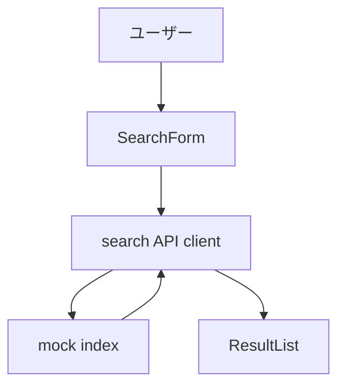

# ブレインストーミング記録

## 日付

- 2026-04-06

## テーマ

- 社内ナレッジ検索アシスタントの初期アーキテクチャ

## コンテキスト

- 現在の状況: 社内ドキュメントが分散しており、検索導線の標準化が求められている
- きっかけ: FAQ 問い合わせ件数の増加

## 検討したアプローチ

### アプローチ A: 実検索基盤を先に構築

- 概要: Elasticsearch 等を導入し、本番同等の検索基盤を初期から構築する
- 利点: 検索品質を早期に検証できる
- 欠点: インフラ構築に時間がかかり、UI / フロー検証が遅れる

### アプローチ B: mock index で UI / フローを先行

- 概要: mock index で薄い検索フローを構築し、UI と evidence flow を先に固める
- 利点: 短期間で MVP が出せ、フレームワークの flow 検証も同時にできる
- 欠点: 検索品質の検証は次フェーズに先送りになる

### アプローチ C (任意): 外部 SaaS 検索サービス

- 概要: 外部の検索 API サービスを利用する
- 利点: インフラ不要で高品質な検索が得られる
- 欠点: 社内情報の外部送信がセキュリティポリシーに抵触する

## 決定

- 採用アプローチ: B（mock index で UI / フローを先行）
- 採用理由: UI と運用フローを短期で固め、検索基盤は後から差し替える方がリスクが低い
- 不採用理由: A はインフラ構築コストが高い、C はセキュリティポリシー違反

## 構造マップ

## スコープ境界

- やること: 検索フォーム、結果一覧、フィルター、出典スニペット
- やらないこと: 権限制御、自動取り込み、分析ダッシュボード

## 未解決事項

- 実検索基盤の選定は次フェーズで検討

## 次のステップ

- [x] 設計ノートを作成する → `docs/specs/search-design.md`
- テンプレート名: `SPEC.template.md`
