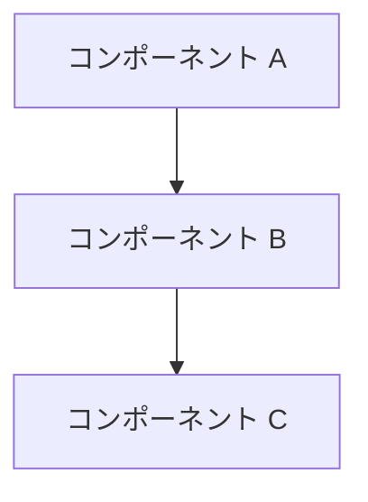

# ブレインストーミング記録
<!-- 正本: brainstorming skill -->

## 日付

- <記入>

## テーマ

- <記入>

## コンテキスト

- 現在の状況: <記入>
- きっかけ: <記入>

## 検討したアプローチ

### アプローチ A: <名称>

- 概要: <記入>
- 利点: <記入>
- 欠点: <記入>

### アプローチ B: <名称>

- 概要: <記入>
- 利点: <記入>
- 欠点: <記入>

### アプローチ C (任意): <名称>

- 概要: <記入>
- 利点: <記入>
- 欠点: <記入>

## 決定

- 採用アプローチ: <記入>
- 採用理由: <記入>
- 不採用理由: <記入>

## 構造マップ（任意）

<!-- 3コンポーネント以上 or 複雑なフローがある場合に記載 -->

## スコープ境界

- やること: <記入>
- やらないこと: <記入>

## 未解決事項

- なし / あれば記入

## 次のステップ

- [ ] 設計ノートを作成する → `docs/specs/YYYY-MM-DD-<topic>-design.md`
- テンプレート名: `SPEC.template.md`
<!-- exit-check: アプローチ決定・スコープ明確 → design note へ -->
